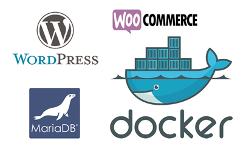

# Wordpress + Woocommerce Docker Setup

Author: [Charles Bido](charlesbido.com)

***Always check scripts, Dockerfiles, or any executable before running them!***

## TL;DR

Easy setup and teardown for Wordpress and Woocommerce using Docker.

Run `docker-compose up -d` and go to [http://localhost:8080/](http://localhost:8080/)

## About

### What is this?

This docker setup makes sure to always pull the latest / most stable versions
of Wordpress, WooCommerce, and MariaDB.

Please refer to `docker-compose.yml` for more info.

### What does it do?

1. Spins up a MariaDB instance for Wordpress. 
2. Spins up a Wordpress instance which will automatically connect to MariaDB.
3. Grabs the latest release of WooCommerce (and other plugins) from GitHub and installs it into Wordpress.

#### Other Plugins
- Gutenberg
- Wordfence

### Why use this?

Because MAMP / WAMP / LAMP will ruin your machine forever :P

## Setup

1. [Install Docker and docker-compose](https://docs.docker.com/engine/installation/#desktop)
2. Download this repo
3. Extract into desired directory (i.e. your Documents folder)

## Usage

1. In a text editor, update `WORDPRESS_DB_PASSWORD` and `MYSQL_ROOT_PASSWORD`
with a matching and unique password in the `docker-compose.yml`
2. Within a terminal, run `docker-compose up -d` to run this setup
3. Run `docker-compose logs -f` to follow the logs to confirm everything
is running smoothly.
4. In you favorite web browser, go to `http://localhost:8080` or to `http://localhost:8080/wp-admin`
5. Enjoy (or don't)

## Persisted Data

This setup also persists wordpress data so you can restart the containers without worrying about data loss.

The following is a table showing where the data within a container is persisted on the host.

| Service | Host | Container |
|---------|-----------|---------------------|
| wordpress    | `./wordpress/www` | `/var/www/html` |
| wordpress_db |  `./wordpress/data` |`/var/lib/mysql` |

## Issues

If you have any problems with this, or have a suggestion, feel free to [create an issue](http://git.charlesbido.com/charles/wordpress-woocommerce-docker-setup/issues)!

## Todo
- [ ] Use nginx
  - [ ] as a reverse proxy
  - [ ] to handle certs for https

